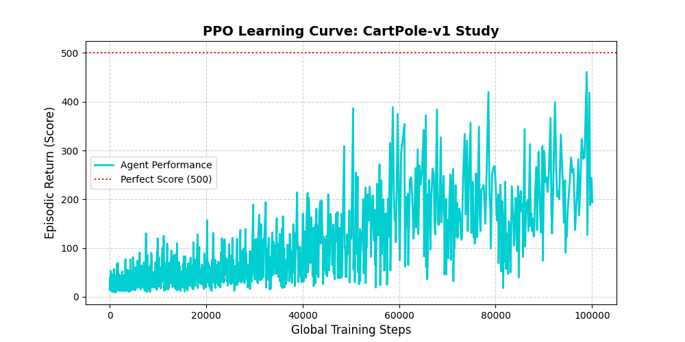

# Reinforcement Learning Experiments: PPO Study on CartPole-v1

An elegant, standalone implementation of the **Proximal Policy Optimization (PPO)** algorithm applied to the Gymnasium `CartPole-v1` classic control task. This project bypasses vectorized logging layer anomalies to deliver direct, clean evaluation curves of deep reinforcement learning convergence.

## Core Architecture

This project features an **Actor-Critic** framework built from scratch using PyTorch:
* **Actor Network:** Maps environmental observations (cart position, velocity, pole angle, angular velocity) to safe discrete actions (Move Left / Move Right).
* **Critic Network:** Estimates state-value functions to compute Generalized Advantage Estimations (GAE), reducing variance during policy updates.

##  Empirical Results

By running a controlled study over **100,000 global training steps**, the agent demonstrated exceptional stability and logarithmic sample complexity, approaching near-perfect balancing performance.

### PPO Learning Curve


## 🚀 Future Enhancements

To expand this study into a comprehensive deep reinforcement learning benchmark suite, the following technical upgrades are planned:

### 1. Advanced Vectorized Environments & Logging Fix
* **Objective:** Transition back to parallelized `SyncVectorEnv` or `AsyncVectorEnv` execution.
* **Implementation:** Implement a robust multi-environment global step tracking lock to prevent the identical-timestamp logging collision that currently overwrites TensorBoard metrics.

### 2. Hyperparameter Optimization (HPO) Grid Search
* **Objective:** Systematically discover the most sample-efficient configuration for PPO.
* **Implementation:** Integrate **Optuna** to run automated trials across a range of learning rates ($\alpha \in [10^{-5}, 10^{-2}]$), clip coefficients ($\epsilon \in [0.1, 0.3]$), and minibatch sizes to map parameter sensitivity.

### 3. Environment Scaling (Continuous Action Spaces)
* **Objective:** Test the actor's robustness when transitioning from discrete tasks to highly complex, continuous physics domains.
* **Implementation:** Adapt the policy network head from a discrete `Categorical` distribution to a continuous Gaussian (Normal) distribution ($\mu, \sigma$) to solve continuous control benchmarks like `Pendulum-v1` and `BipedalWalker-v3`.

### 4. Policy Evaluation & Render-to-Video
* **Objective:** Visually audit the agent's balancing strategies post-training.
* **Implementation:** Add a standalone evaluation loop utilizing `gym.wrappers.RecordVideo` to capture high-definition MP4 playbacks of the fully converged neural network balancing the pole effortlessly.

## Installation & Execution
1. Clone this repository:
   ```bash
   git clone [https://github.com/Prasannasavalla/ppo-cartpole-study.git](https://github.com/Prasannasavalla/ppo-cartpole-study.git)
   cd ppo-cartpole-study
2.Set up the virtual environment:
Bash
python -m venv ppo_study
source ppo_study/bin/activate  # On Windows use: ppo_study\Scripts\activate
3. Install required dependencies:
Bash
pip install gymnasium[classic-control] torch matplotlib
4. Run the master training script:
Bash
python test_ppo.py